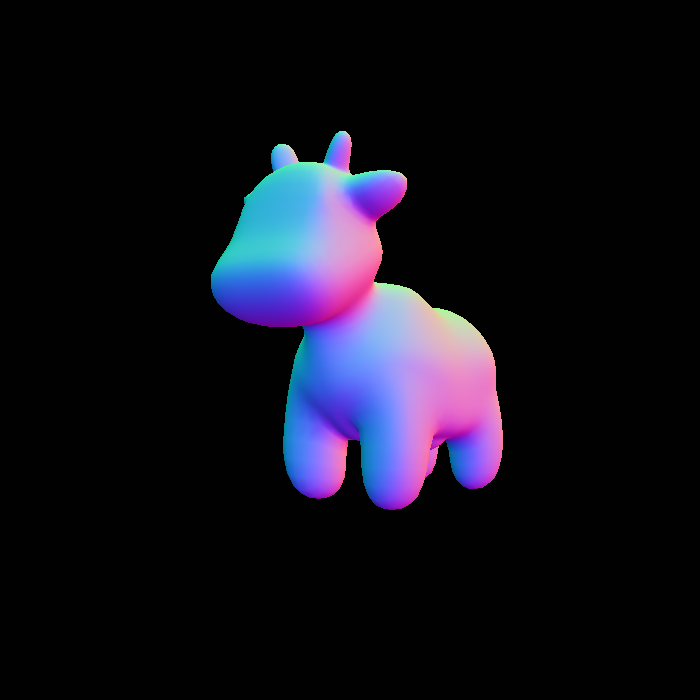

# Games 101 Report

- Yuxuan Wang 523031910157

## Lab 1

没啥好说的...

Projection Matrix 中的 $M_{persp}$ 前三项应有负号，教程似乎有误。

绕任意轴旋转代码示例如下：
```rust
pub(crate) fn get_rotation_matrix(axis: V3f, rotation_angle: f64) -> Matrix4<f64> {
    let rotation_angle = rotation_angle / 180.0 * PI;
    let mut r = rotation_angle.cos() * Matrix3::identity() + 
        (1.0 - rotation_angle.cos()) * (axis * axis.transpose()) + 
        rotation_angle.sin() * Matrix3::new(
            0.0, -axis[2], axis[1],
            axis[2], 0.0, -axis[0],
            -axis[1], axis[0], 0.0
        );
    return extend_matrix3_to_matrix4(&r)
}
```

经测试有效

## Lab 2
### 图像展示
**No Anti Aliasing：**


**MSAA(x4):**


**TAA:**


#### Anti Aliasing 效果：
- No Anti Aliasing 下有明显在方形锯齿。
- MSAA(x4) 就已经可以较好的消除锯齿，达到类似渐变的效果。
- TAA 在帧率达到 100 之后效果较好。边界模糊，有毛刺感。

似乎和游戏的里用 MSAA TAA 的主观感觉差不多。

#### Anti Aliasing渲染时间：
- No Anti Aliasing : 420ms/frame
- MSAA 1800ms/frame
- TAA: 770ms/frame

和预期差不多，MSAA(x4) 比 No Anti Aliasing 多 4 倍采样，TAA 则多一次和上一帧求平均的尾处理。

不过此处渲染的物体较少，重叠少，使得重复采样较少，实际 TAA 可能表现更优。

### 关于走样的本质理解
两个频率无法在指定采样频率下区分的现象称为“走样”。

光栅化实际上是对空间进行采样，其走样体现为锯齿。

图像空间信息也可以通过 Fourier 变化转化为频率信号，而对于信息的高频部分(在 2D 图像上刻画小范围的快速变化)，低频采样无法精确采样其信息，导致了信息丢失。

根据 Nyquist-Shannon 采样定理，为了正确重构一个信号，采样频率必须至少是信号中最高频率成分的两倍。如果采样频率不足这个要求，高频信号将无法被正确采样，而表现为低频信号(产生走样现象)。

## Lab 3

### 图像展示
#### Normal


#### Phong


#### Texture (bilinear color sampling)


#### Bump


#### Displacement


Bump 和 Displacement 里的 h 用了 color.norm()
以及环境光应该在多个光源之间只算一次。

---

## Bilinear Coloring:

#### Basic Coloring:


#### Bilinear Coloring:


观察眼部附近，明显看出 Bilinear 的纹理更细致平滑，效果还是不错的。

---

$\mathcal{End\ of\ Document}$