# Ray Tracer Book 1 Report

### Chapter 1-5 

完全按教科书翻译。
为 Vec3 等类实现了 Clone 和 Copy，不然用起来太烦了。

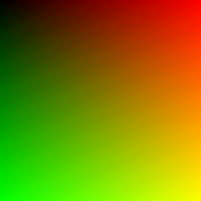


---

### Chapter 6

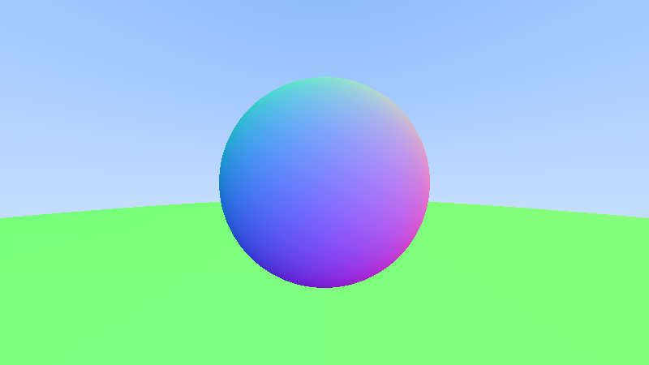

关于 Hittable 继承的 Rust 实现：

- **Solution : 采用 trait 和 type Object = Rc\<dyn Hittable\> 实现**

```rust

// Hittable Trait
pub trait Hittable: Send + Sync{
  fn hit(&self, ray: &Ray, ray_t: Interval, rec: &mut HitRecord) -> bool;
  fn to_object(self) -> Object;
}

// use Arc::new, instead of Object::new btw
pub type Object = Arc<dyn Hittable + Send + Sync>; // Shared Ptr
```

- **后续为多线程安全问题采用 Object = Arc\<dyn Hittable + Sync + Send\>**

---

### Chapter 7-8

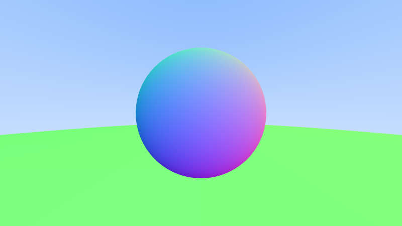
抗锯齿采样开了 100 次。后续渲染都开了抗锯齿。(教科书似乎没有)。

### Chapter 9
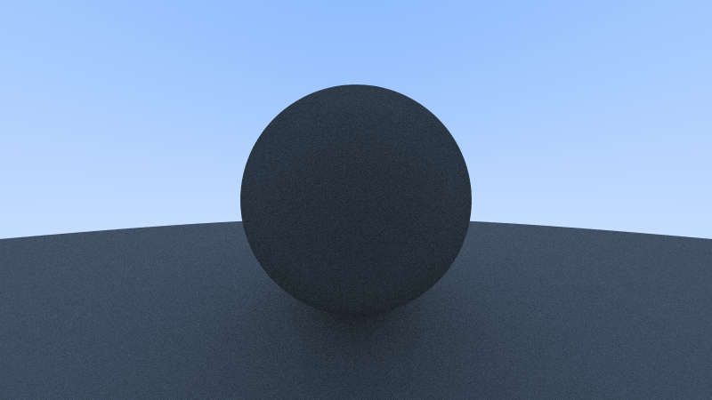
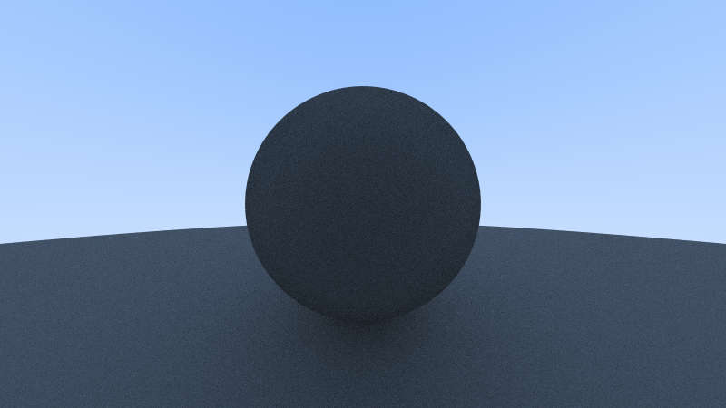
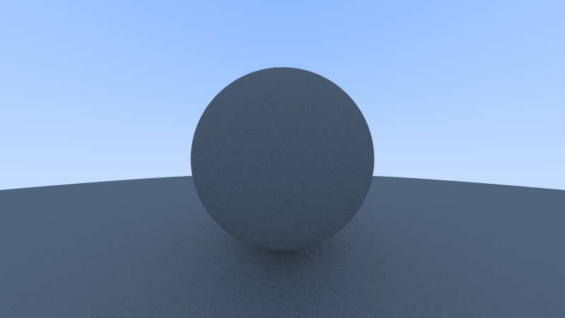

大部分是纯翻译。
不过对于书上生成随机单位向量，三位随机生成再取一个单位球内的做法效率表示怀疑...自己用了球坐标的参数生成法。也许三角函数运算比 reject 更慢？


### Chapter 10
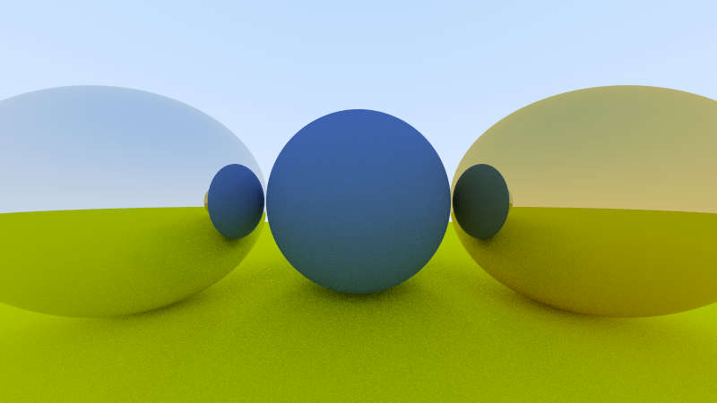
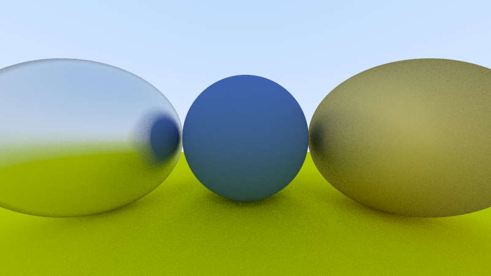


关于 Material 的实现
- **类似的采用 Scatter trait 和 Material = Arc\<dyn Scatter + Sync + Send\> 实现。**

```rust
pub trait Scatter {
  fn scatter(&self, ray_in: &Ray, rec: &HitRecord, attunation: &mut ColorType, scattered: &mut Ray) -> bool;
  fn to_material(self) -> Material;
}

pub type Material = Arc<dyn Scatter + Sync + Send>;
```

### Chapter 11
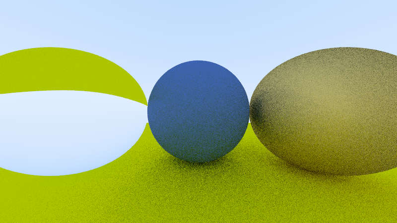
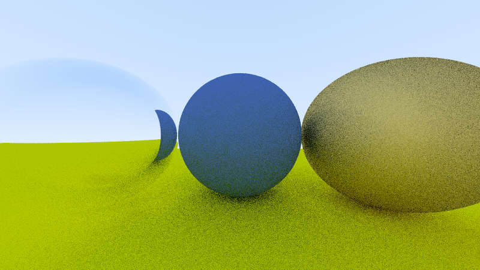
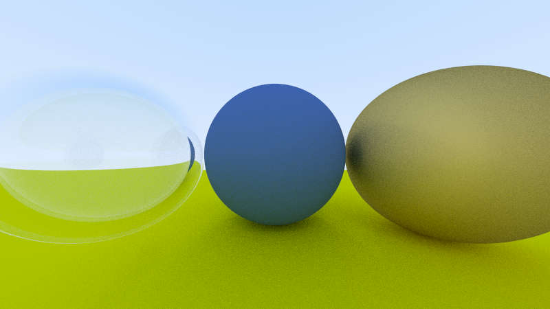
一开始折射向量系数忘记开根号了，有点奇怪。改了就好了

```rust
// reflection
    pub fn reflect(v: Vec3, n /* unit */: Vec3) -> Vec3 {
        v - 2.0 * Vec3::dot(&v, &n) * n
    }
// refraction
    pub fn refract(uv/* unit v */: Vec3, n /* unit */: Vec3, ratio /* eta_i over eta_t*/: f64) -> Vec3 {
        let cos_theta: f64 = n.dot(&(-uv)).min(1.0);
        let r_out_perp: Vec3 = ratio * (uv + cos_theta * n);
        let r_out_parallel: Vec3 = -(1.0 - r_out_perp.norm_squared()).abs().sqrt() * n;
        r_out_perp + r_out_parallel
    }
```

### Chapter 12-13

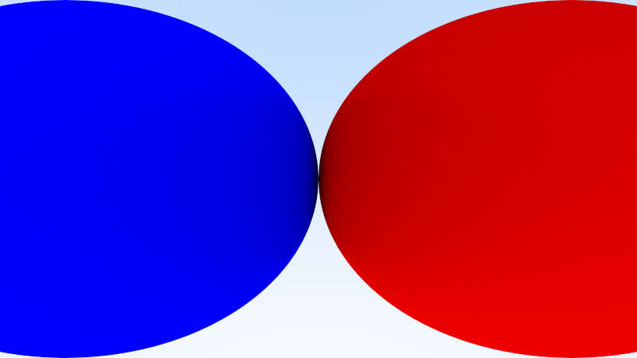
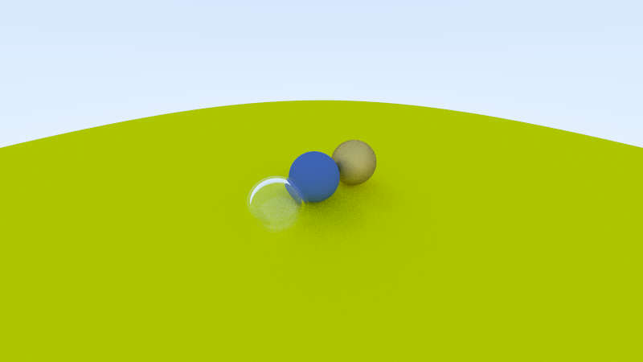
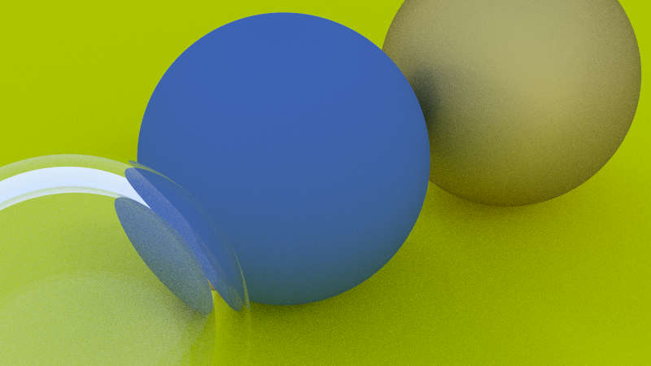

摄像机...纯翻译

### Final Scene
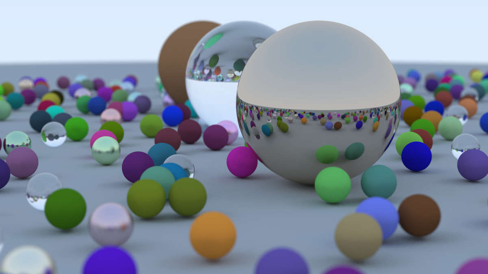
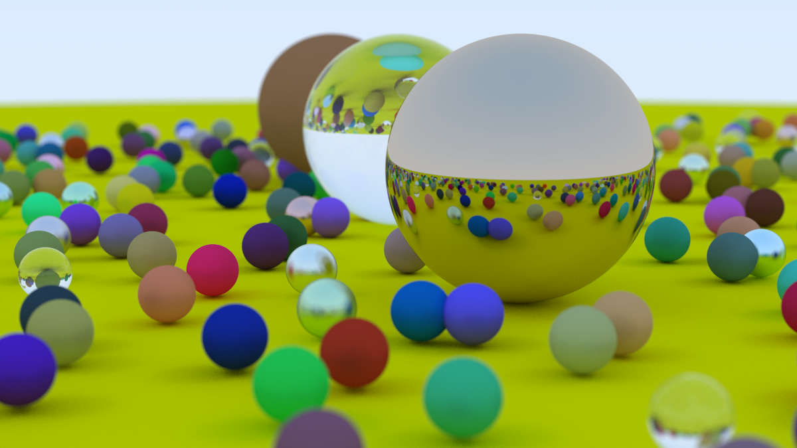
(地面颜色忘记换成和书一样了，小问题)。

### 多线程优化

调整 Camera::rend 函数为 rend_sub 渲染指定长方形区域，rend 函数自身改为任务分配函数。

> 显著问题: std::thread 要求传给其的变量都有 static 的生命周期，这显然很蠢，因为我保证所有 threads 会在 rend return 之前 join，结果一直过不去编译。

Solution:
- 采用 crossbeam::scope 和 thread 代替。


初代：

- 设置 WIDITH_PARTITION / HEIGHT_PARITION 参数，表示横纵分割数。
- 同时启动所有子任务线程，渲染好一个像素就写一个像素。

> 显著问题：Contention 非常严重，虽然理论上 img 写入应该是互不干扰的，但是 rust 一定要给其加个锁，所以很慢。

Improvement 1

- rend_sub 先把渲染局部结果存在 buff 里，渲染好之后获取 img 的锁，一次性写完。

效果明显，因为渲染是算力瓶颈，而写入 img 很快，故竞争极大缓解。

> 显著问题：不同渲染子任务运算量差距较大，导致较慢的子任务拖慢了整体渲染时间。

Improvement 2

- 划分成更细的子任务，使得子任务数远大于实际线程数。
- 为避免太多线程竞争，设置 THREAD_LIMIT 参数。并且采取一些通信协调的方式，控制启动的线程数不超过上述限制。

具体实现也就是用一个 AtomicUsize 记录目前运行的线程数，和一个 Condition Varible 在任务分配的主线程里控制放行的线程数(如果当前线程数达到上限那就等会再放下个任务出去)。

效果显著，用 16 核心快了近 10 倍吧。如果开 --release 的话 final scene 只需要 3min。

--- 

多线程核心代码：

```rust
use crossbeam::thread;
...
impl Camera {
...
  pub fn render(&self, world: &Object) -> RgbImage { 
    let mut img: RgbImage = ImageBuffer::new(self.image_width as u32, self.image_height as u32);

    println!("[Render progress]:");
    let bar = get_ProgressBar(self.image_height, self.image_width);
    let bar_wrapper = Arc::new(&bar);

    let camera = Arc::new(self.clone());
    let world = Arc::new(world);
    let img_mtx = Arc::new(Mutex::new(&mut img));
    
    thread::scope(move |thd|{
      let thread_count = Arc::new(AtomicUsize::new(0));
      let thread_number_controller = Arc::new(Condvar::new());
      
      let chunk_height = (self.image_height + HEIGHT_PARTITION - 1) / HEIGHT_PARTITION;
      let chunk_width = (self.image_width + WIDTH_PARTITION - 1) / WIDTH_PARTITION;
      for j in 0..HEIGHT_PARTITION {
        for i in 0..WIDTH_PARTITION {
          let lock_for_condv = Mutex::new(false);
          while !(thread_count.load(Ordering::SeqCst) < THREAD_LIMIT) { // outstanding thread number control
            thread_number_controller.wait(lock_for_condv.lock().unwrap()).unwrap();
          }

          
          let bar = Arc::clone(&bar_wrapper);

          let camera = Arc::clone(&camera);
          let world = Arc::clone(&world);
          let img_mtx = Arc::clone(&img_mtx);
          
          let thread_count = Arc::clone(&thread_count);
          let thread_number_controller = Arc::clone(&thread_number_controller);

          thread_count.fetch_add(1, Ordering::SeqCst);
          bar.set_message(format!("|{} threads outstanding|", thread_count.load(Ordering::SeqCst))); // move out of thread, so that its sequential with thread number control code

          let _ = thd.spawn(move |_| {
            camera.render_sub(&world, &img_mtx, &bar, 
              i * chunk_width, (i + 1) * chunk_width, 
              j * chunk_height, (j + 1) * chunk_height);
            // println!("subtask ({}, {}) done", i, j);
            thread_count.fetch_sub(1, Ordering::SeqCst);
            bar.set_message(format!("|{} threads outstanding|", thread_count.load(Ordering::SeqCst)));
            thread_number_controller.notify_one();
          });

        }
      }
    }).unwrap();

    bar.finish();
    img
  }
  
  pub fn render_sub(&self, world: &Object, img_mtx: &Mutex<&mut RgbImage>, bar: &ProgressBar, x_min: usize, x_max: usize, y_min: usize, y_max: usize) {
    let x_min = x_min.max(0);
    let y_min = y_min.max(0);
    let x_max = x_max.min(self.image_width);
    let y_max = y_max.min(self.image_height);

    let mut buff: Vec<Vec<ColorType>> = vec![vec![ColorType::zero(); y_max - y_min]; x_max - x_min];
    for j in y_min..y_max {
        for i in x_min..x_max {
          let mut pixel_color = ColorType::zero();
          for _ in 0..self.sample_per_pixel {
            let ray = self.get_ray(i, j);
            pixel_color += self.ray_color(&ray, 0 as usize, &world);
          }
          pixel_color *= self.pixel_samples_scale;

          buff[i - x_min][j - y_min] = pixel_color;
          // bar.inc(1); // fact: bar.inc 相当慢，脱了速度
        }
        bar.inc((x_max - x_min) as u64);
      }
      let mut img = img_mtx.lock().unwrap();
      for j in y_min..y_max {
        for i in x_min..x_max {
          write_color_01(buff[i - x_min][j - y_min], &mut img, i, j);
        }
      }
  }
}
```

---

以及对 ProgessBar 做了一点点美化：
```rust
pub fn get_ProgressBar(height: usize, width: usize) -> ProgressBar {
  let bar: ProgressBar = if is_ci() {
      ProgressBar::hidden()
  } else {
      ProgressBar::new((height * width) as u64)
  };

  bar.set_style(ProgressStyle::default_bar()
  .template("{spinner:.green} Elapsed {elapsed_precise} [{wide_bar:.cyan/blue}] {pos}/{len} ({eta}) {msg}")
  .progress_chars("●▸▹⋅"));

  bar
}
```

其中 msg 块是用来显示目前运行的子线程数的，由 render 函数设置，效果如下：

>⠲ Elapsed 00:02:26 [●●●●●●●●●●●●●●●●●●●●●●●●●●●●●●●●●●●●●●●●●●●●●●●●●●●▸⋅⋅⋅⋅⋅⋅⋅⋅⋅⋅⋅⋅⋅⋅⋅⋅⋅⋅⋅⋅⋅⋅⋅⋅⋅⋅⋅⋅⋅⋅⋅⋅⋅] 494760/810000 (1m) |24 threads outstanding|