# Ray Tracer Book 2 Report

## Chapter 2 Motion Blue

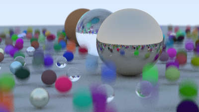

好像没出什么问题。就是 Rust 不能重载多个函数，所以只好用两个分开。
```rust
  pub fn new_static(center: Point3, radius: f64, mat: Material) -> Self {
    Self::new(center, radius, mat, Vec3::zero())
  }
  pub fn new_moving(center: Point3, center_after_move: Point3, radius: f64, mat: Material) -> Self {
    Self::new(center, radius, mat, center_after_move - center)
  }
```

## Chapter 3 BVH

核心是重新学了下 Rust 里怎么自定义排序，其它没出问题。
效率优化显著，大概 5 倍还是有的？不过因为之前就写了多线程所以几秒就跑完了，看不太出来。

```rust
      _ => {
        objects[start..end].sort_by(|a, b| Self::box_compare(a, b, axis)); // how to sort

        let mid = (start + end) / 2;
        left = BvhNode::new_range(objects, start, mid).to_object();
        right = BvhNode::new_range(objects, mid, end).to_object();
      }
```

## Chapter 4 Texture Mapping
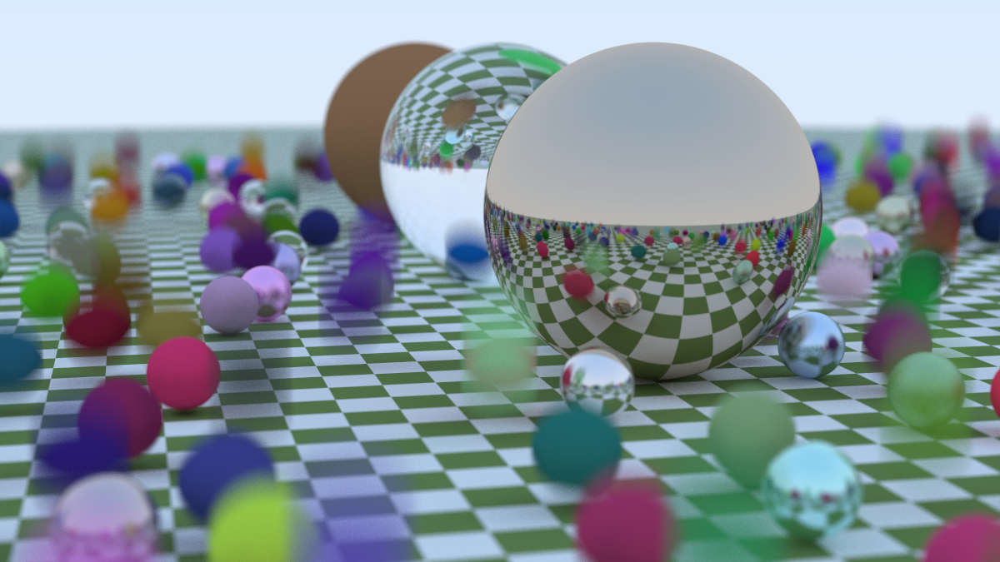
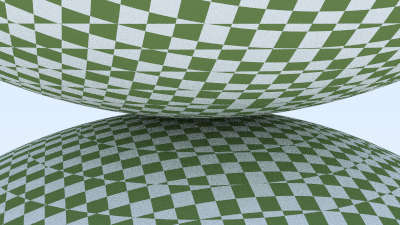
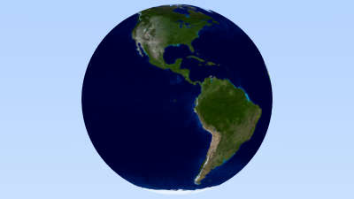

核心挑战是... ImageTexture 如何用 rust 加载一张图片: Games101 的 opencv 代码复用了。

以及为了把 opencv 的图像裸指针多线程，不得不上 unsafe Send + Sync。
```rust
unsafe impl Send for ImageTexture {}
unsafe impl Sync for ImageTexture {}
```

## Chapter 5 Perlin Noise
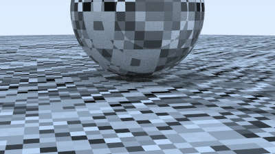
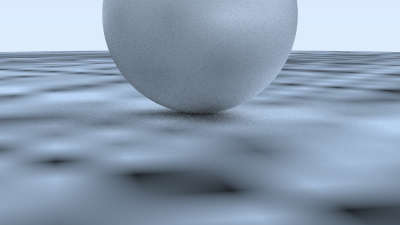
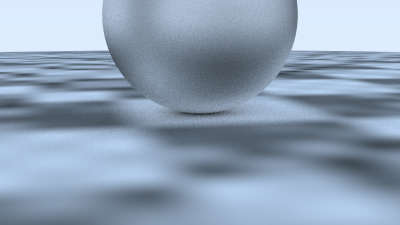
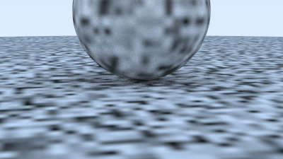
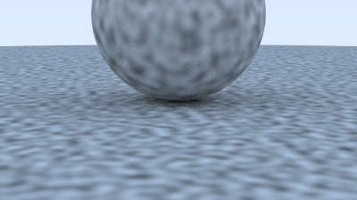
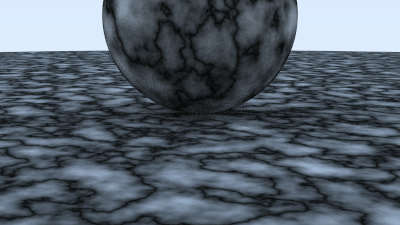
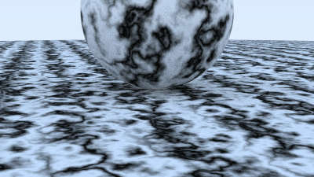

折磨 Debug: 渲染的时候噪声明显有沿着坐标轴方向的条纹现象，直觉说明噪声哪里写错了。最后发现是 permutation 生成的时候用
> for i in n-1..0 {}

结果是，这个 range 是空的，不能倒着遍历。 改成 
> for i in (1..=n-1).rev() {}

之后好了。


以及感觉作者这样 `(i*uu + (1-i)*(1-uu))` ($i \in \{0, 1\}$)的写法...常数挺大的吧，自己实现用三目运算符代替了。

## Chapter 6 Quadrilaterals

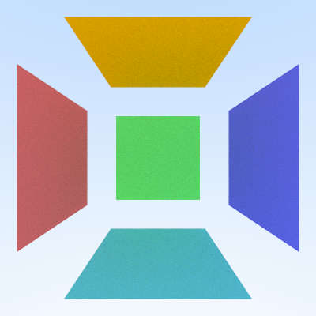

挺有意思的数学，之前计算几何没怎么学过空间中平面图形和射线求交。(注: 写在 planar.rs 中了，不是 quad.rs)

实现了 Planar Trait，包含 fn is_interior，可以比较容易的改造成三角形。

```rust
impl Planar for Quad {
  fn is_interier(&self, a: f64, b: f64, rec: &mut HitRecord) -> bool {
    let unit_interval = Interval::new(0.0, 1.0);

    if !unit_interval.contains(a) || !unit_interval.contains(b) {
      false
    } else {
      rec.u = a;
      rec.v = b;
      true
    }
  }
}

```

## Chapter 7 Lights
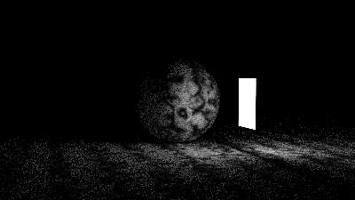
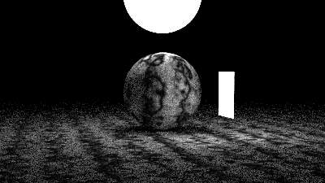
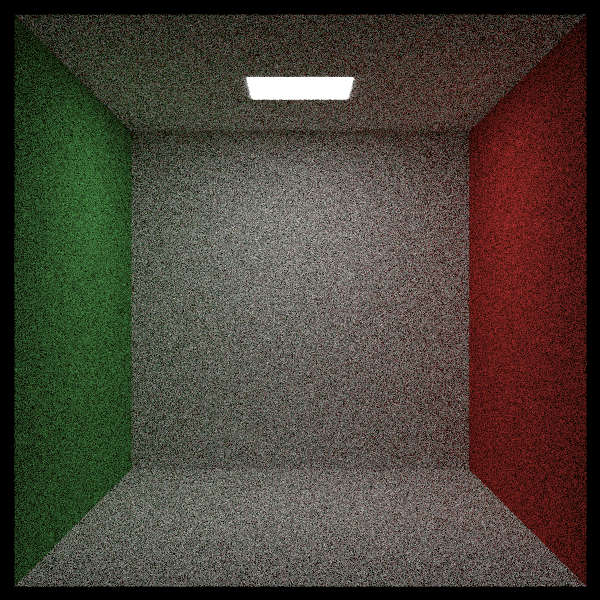

核心问题：一开始光的反射存在明显问题，Image17 的正表面偏亮，且 Image18 的球形光源没有产生均匀的环形光，在 z 轴方向上明显更强。

用单纯球光源效果如图：
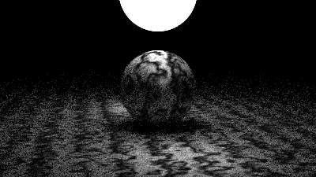

Debug 了一晚上，原因：
```rust
  // Lambertian
  let mut scatter_dircton = rec.normal + Vec3::rand_unit();
```

Vec3::rand_unit() 采用了球坐标生成，并不是均匀分布，使得特定方向的反射光线极多。
改用空间内随机的方式后就好了。

## Chapter 8 Instances
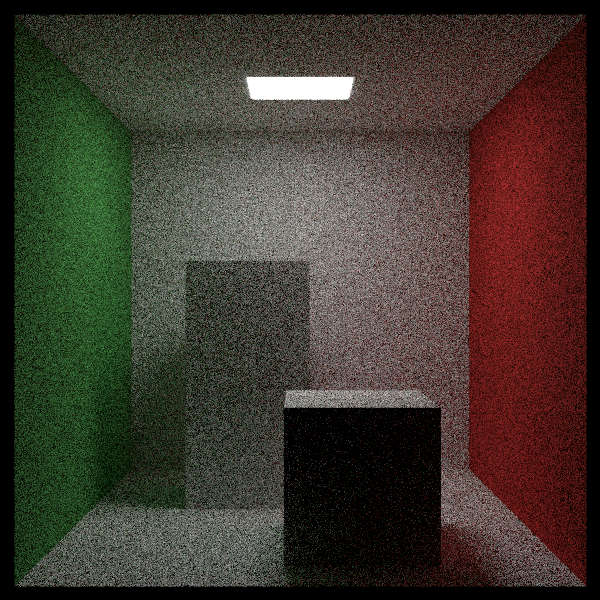
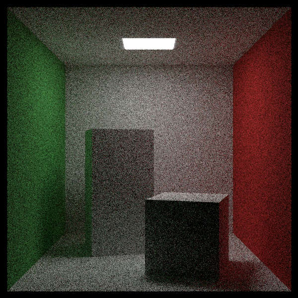

没遇到啥问题。就是觉得作者写的 rotate 部分有太多次重复的手动旋转代码，故写了 rotate_pos / rotate_neg 简化代码。

```rust
// RotateY
  fn rotate_neg(&self, v: Vec3) -> Vec3 {
    Vec3::new(
      self.cos_theta * v.x - self.sin_theta * v.z,
      v.y,
      self.sin_theta * v.x + self.cos_theta * v.z
    )
  }

  fn rotate_pos(&self, v: Vec3) -> Vec3 {
    Vec3::new(
      self.cos_theta * v.x + self.sin_theta * v.z,
      v.y,
      -self.sin_theta * v.x + self.cos_theta * v.z
    )
  }
```

## Chapter 9 Volumes

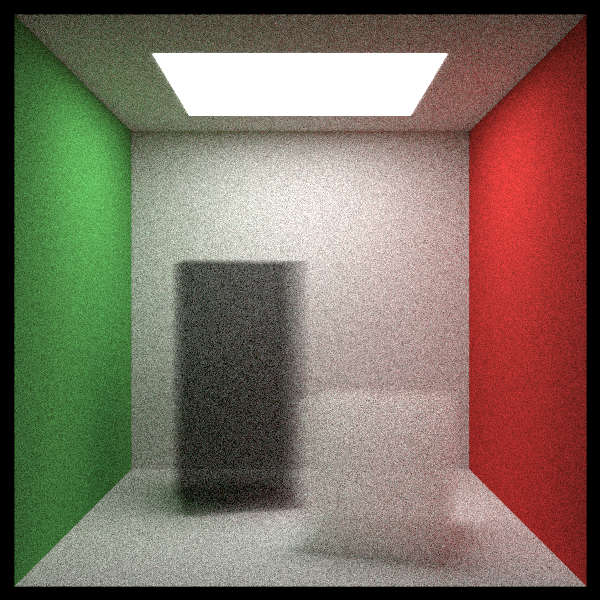

一开始出了个小锅，两个长方体的地面呈现出明亮的地板颜色。查了一段时间发现是 build_box 中生成 bottom 面写错了，而之前的图是实体长方体，看不出来。

## Final Scene

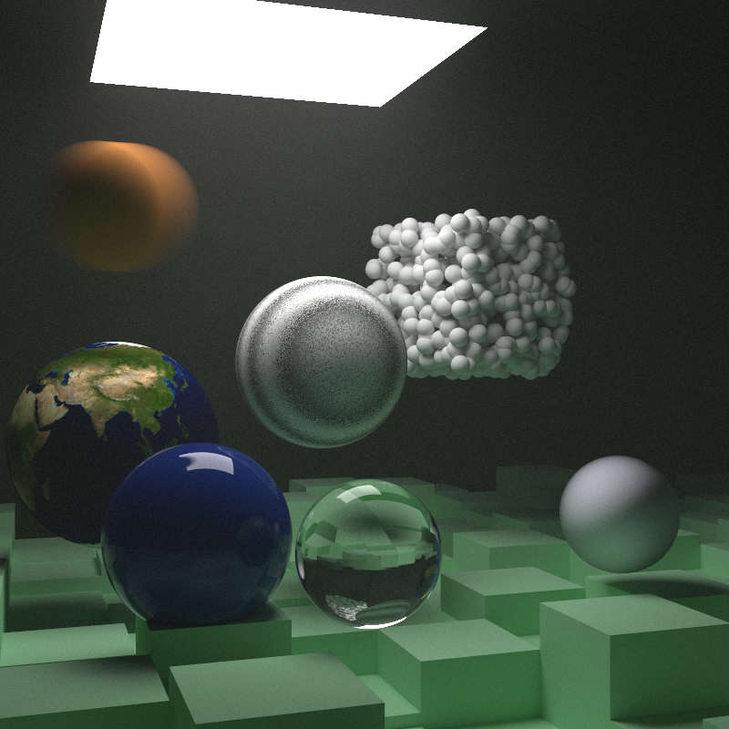

跑了 40min，还算能接受。